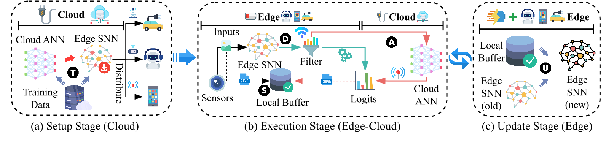

# ECC-SNN
Official code for "ECC-SNN: Cost-Effective Edge-Cloud Collaboration for Spiking Neural Networks" (IJCAI'2025)

## Overview
<p align="center">

</p>

## How to run

### Setup Stage:

```
python prepare.py -nt=5 -patience=50 -b=64 -ce=30 -ee=200 -cloud=vit -edge=svgg -dataset=cifar100 -T=4 -gpu=0 -distill -pretrain
```

### Running Stage:

- preparing models for each task
    ```
    python update.py -nt=5 -cloud=vit -edge=svgg -dataset=cifar100 -T=4 -gpu=2 -pretrain
    ```
- evaluating performance
    ```
    python evaluation.py -nt=5 -cloud=vit -edge=svgg -dataset=cifar100 -T=4 -gpu=2 -pretrain -tag -thr=0.7
    ```

## Cite

Please cite the following paper if you find our work contributes to yours in any way:

```
@inproceedings{yu2025eccsnn,
  title     = {ECC-SNN: Cost-Effective Edge-Cloud Collaboration for Spiking Neural Networks},
  author    = {Di, Yu and Xin, Du and Linshan, Jiang and Huijing, Zhang and Shuiguang, Deng},
  booktitle = {Proceedings of the Thirty-Fourth International Joint Conference on
               Artificial Intelligence, {IJCAI-25}},
  year      = {2025} 
}
```